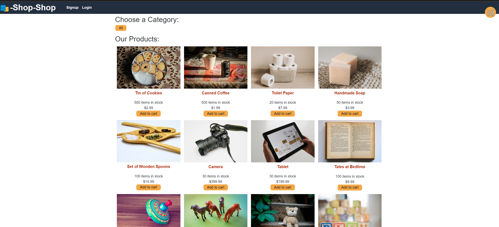
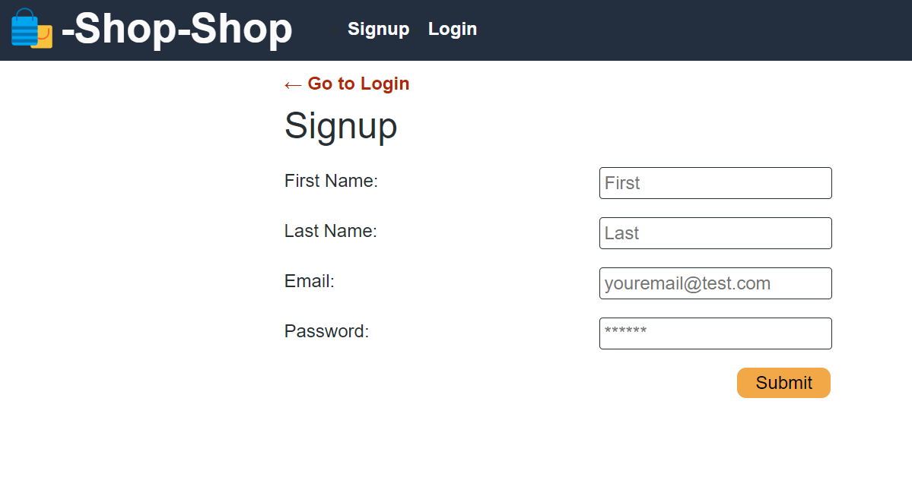
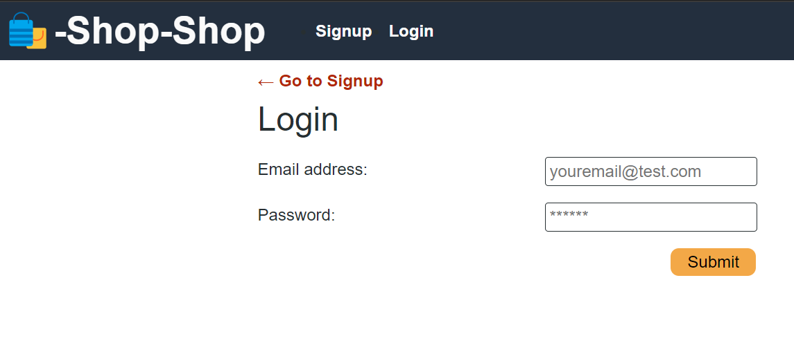
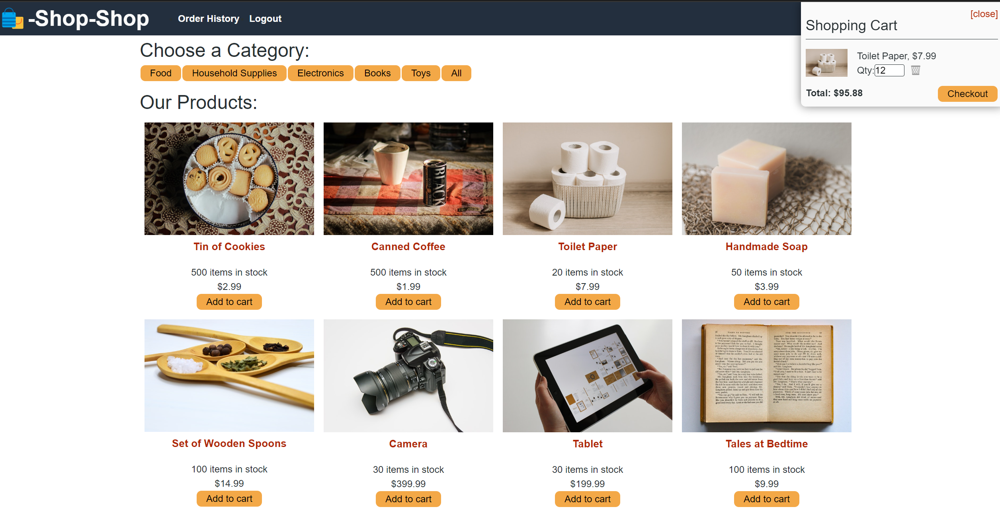
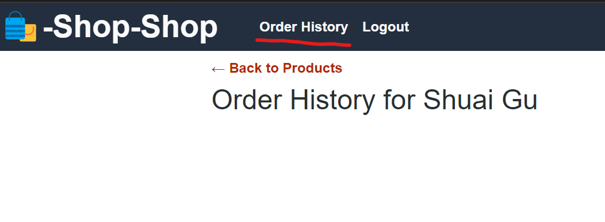

<a id="readme-top"></a>


<div align="center">
  <a href="https://github.com/Jason897571/Raccoon-Redux-Store">
    <span role="img" aria-label="shopping bag">🛍️</span>
  </a>

  <h3 align="center">Raccoon Redux Store</h3>

  <p align="center">
    This is a E-commerce website to sell products. It allows users to login and sign up. The customer is able to add their items into cart and checkout.
    <br />
    <br />
    <a href="https://github.com/Jason897571/Raccoon-Redux-Store"><strong>Click here for Github Repo  »</strong></a>
    <br />
    <br />
    <a href="https://raccoon-redux-store.onrender.com">Deployed Website</a>
    ·
    <a href="https://github.com/Jason897571/Raccoon-Redux-Store/issues">Report Bug</a>
    ·
    <a href="https://github.com/Jason897571/Raccoon-Redux-Store/issues">Request Feature</a>
  </p>
</div>

<!-- TABLE OF CONTENTS -->
<details>
  <summary>Navigation of Contents</summary>
  <ol>
    <li>
      <a href="#about-the-project">About The Project</a>
      <ul>
        <li><a href="#built-with">Built With</a></li>
      </ul>
    </li>
    <li>
      <a href="#getting-started">Getting Started</a>
      <ul>
        <li><a href="#prerequisites">Prerequisites</a></li>
        <li><a href="#installation">Installation</a></li>
      </ul>
    </li>
    <li><a href="#usage">Usage</a></li>
    <li><a href="#contact">Contact</a></li>
    <li><a href="#future_additions">Future Additions</a></li>
    <li><a href="#reference">Reference</a></li>
  </ol>
</details>

<a id="#about-the-project"></a>
## About The Project

<p><strong>Start Page</strong></p>




<br />

This is the start page where you can search books or login and sign up.


<a id="#built-with"></a>
## Built with
This generator is made with Javascript.

* 
* 


<p align="right">(<a href="#readme-top">back to top</a>)</p>

<a id="getting_started"></a>
## Getting Started

You cold see the website through visiting the link: https://raccoon-redux-store.onrender.com//

<a id="prerequisities"></a>
### Prerequisites

You should have your shell ready for downloading this project. We use gitbash as an example in this project

<a id="installation"></a>
### Installation
1. Get a free API Key at [github](https://github.com/Jason897571/Raccoon-Redux-Store#built-with)
2. Clone the repo
   ```sh
   git clone https://github.com/Jason897571/Raccoon-Redux-Store.git
   ```

3. In your terminal, input `npm run dev` to start both front and back end. Before start the project, you should input `npm run seed` to import data and input `npm i && npm run install` to install necessary packages.

4. After the project is running, you can visit the website through the link: https://raccoon-redux-store.onrender.com/


<p align="right">(<a href="#readme-top">back to top</a>)</p>


<a id="usage"></a>
## Usage


### Sign Up/Login


By clicking the Login/Sign Up button in the right corner, you are able to sign up an account and login


### Add Items to Cart


By clicking the Add to Cart, you are able to Add the items into your cart.

### See Your Order History


By clicking the `Order History` button, you are able to see your order history.


For more details, please refer to the [Documentation](https://github.com/Jason897571/Raccoon-Redux-Store) 
<p align="right">(<a href="#readme-top">back to top</a>)</p>


<a id="future_additions"></a>
## Future Additions
* Add more functions to my website


<p align="right">(<a href="#readme-top">back to top</a>)</p>


<a id="contact"></a>
## Contact

Jason Gu - [Email](king.gs1314@outlook.com) - king.gs1314@outlook.com

Project Link: [https://github.com/Jason897571/Raccoon-Redux-Store](https://github.com/Jason897571/Raccoon-Redux-Store)

<p align="right">(<a href="#readme-top">back to top</a>)</p>

<a id="reference"></a>
## Reference
* Xpert Assistant/ChatGPT
* https://dev.to/envoy_/150-badges-for-github-pnk#games
* https://github.com/othneildrew/Best-README-Template


<p align="right">(<a href="#readme-top">back to top</a>)</p>


